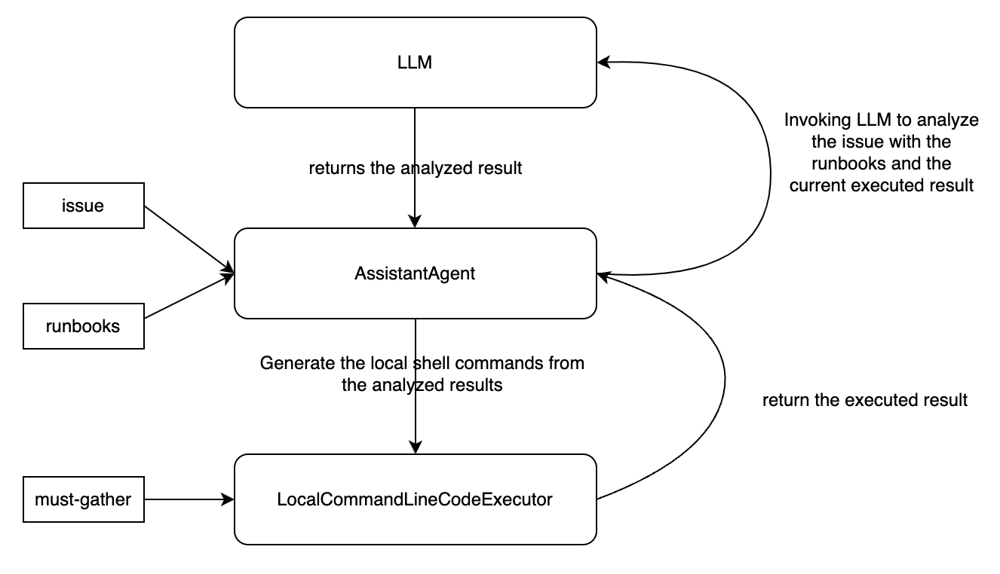

## Prepare

1. Create a virtual environment

```sh
VENV=<your-python-virtual-environment-dir>
python -m venv $VENV
source $VENV/bin/activate
```

2. Install dependents

```sh
make deps
```

## Diagnose an ACM issue with runbooks and must-gather

```sh
export GROQ_API_KEY=<your-groq-api-key> # https://console.groq.com/docs/models
python -m apps.diagnosis --runbooks=<your-runbooks-dir> \
    --hub-mg=<your-hub-must-gather-dir> --cluster-mg=<your-managed-cluster-must-gather-dir> \
    <your-issue>
```

### How does this work

Inspired by [Plan-and-Execute](https://langchain-ai.github.io/langgraph/tutorials/plan-and-execute/plan-and-execute/) pattern



Refers to
- https://microsoft.github.io/autogen/
- https://github.com/gmeghnag/omc

### Runbook Guideline

For a runbook, it should

1. Give a title for the runbook, the title summarizes the issue that this runbook aims to diagnosis.
2. Clearly and detailedly describe the issue, for example
    - describe the issue's symptom, for example, the condition status of a resource when the issue happens, the error message, etc;
    - describe why this issue happens and which components or resources will be impacted when this issue happens, etc.
3. Clearly and detailedly describe describe the diagnosis steps, for example
    - list the diagnosis steps one-by-one;
    - specify whether the step should be run on the hub cluster or the managed cluster;
    - if one step needs to refer to the other runbooks, using the related runbook title as the markdown link text, for example, `[runbook_title](runbook_location)`

## Create Runbooks from a Jira issue

```sh
export JIRA_TOKEN=<your-jira-token> # https://issues.redhat.com/secure/ViewProfile.jspa?selectedTab=com.atlassian.pats.pats-plugin:jira-user-personal-access-tokens
export GROQ_API_KEY=<your-groq-api-key> # https://console.groq.com/docs/models

python -m apps.runbook <your-jira-issue-id>
```

### How does this works

1. Using Jira SDK to get the Jira issue content.
2. Invoking the LLM with the below prompt,
    ```
    You are a Red Hat Advanced Cluster Management for Kubernetes (ACM or RHACM) assistant.
    The following content is about an ACM issue, please 
    - Summarize the issue
    - Give the issue's symptom
    - Give the troubleshooting steps for this issue
    - Give the solution of this issue

    Here is the content

    {text}
    ```
